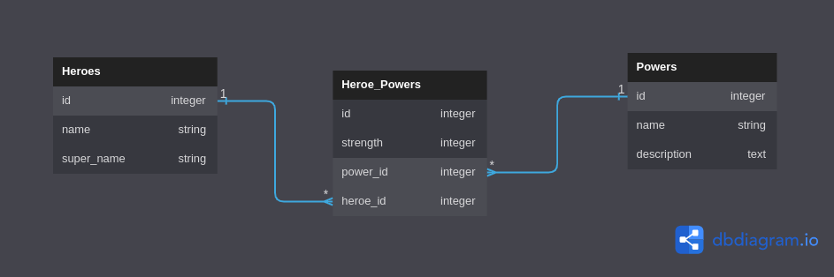

# SuperHeroes API

This is a simple web API for SuperHeroes and their respective powers 

## API live link

- [https://heroes-nuqo.onrender.com](https://heroes-nuqo.onrender.com)

    - use the provided endpoints on the `ROUTES` section to test the API.

## Pre-Requisites
In order to use this repository you will need the following:

- Operating System **(Windows `10+`, Linux `3.8+`, or MacOS X `10.7+`)**
- RAM >= 4GB
- Free Space >= 2GB

## Built With
This application has been built with the following tools:

- **Ruby `v3.0.+`**
- **SQlite3 `v1.6`**
- **ActiveRecord `v7.0.4`**
- **Rails `v7.0.6`**

## Setup Locally
You can setup this repository by following this manual

1. Clone the repository
    ```{shell}
   git clone https://github.com/sainamercy/heroes
   ```
2. Ensure the ruby gems are setup in your machine
    ```{shell}
   bundle install
   ```
3. Perform any pending database migrations
   ```{shell}
   rails db:migrate rails db:seed
   ```
4. Run to start the server
    ```{shell}
    rails s
    ```
    - Use provided link and the endpoints on the `ROUTES` section to test the API.
   
## Application

This application is a simple web API that allows users to:

- View all heroes
- View a specific heroe datails
- View all power
- View specific power datails
- Update specific power
- Create assiciation between heroes and powers through heroe_power

### MODELS

Database schema definitions and associations.




### ROUTES

1. `GET /heroes` - Lists all heroes.
   
   ```{json}
   ## RESPONSE SAMPLE
   [  

    { "id": 1, "name": "Kamala Khan", "super_name": "Ms. Marvel" },  

    { "id": 2, "name": "Doreen Green", "super_name": "Squirrel Girl" },  

    { "id": 3, "name": "Gwen Stacy", "super_name": "Spider-Gwen" }

    ]
 
   ```
2. `GET /heroes/:id` - Gets details of a specific heroe

   ```{json}
   ## RESPONSE SAMPLE
    {
    "id": 1,
    "name": "Kamala Khan",
    "super_name": "Ms. Marvel",
    "powers": [
        {
        "id": 1,
        "name": "super strength",
        "description": "gives the wielder super-human strengths"
        },
        {
        "id": 2,
        "name": "flight",
        "description": "gives the wielder the ability to fly through the skies at supersonic speed"
        }
    ]
    }
   
3. `GET /powers` - List all powers.

   ```{json}
   ## RESPONSE SAMPLE
   [
    {
        "id": 1,
        "name": "super strength",
        "description": "gives the wielder super-human strengths"
    },
    {
        "id": 1,
        "name": "flight",
        "description": "gives the wielder the ability to fly through the skies at supersonic speed"
    }
    ]
   ```
4. `GET /powers/:id` - Gets details of a specific power

```{json}
   ## RESPONSE SAMPLE
    {
        "id": 1,
        "name": "super strength",
        "description": "gives the wielder super-human strengths"
     }
   ```

5. `PATCH /powers/:id` - Update an existing power

```{json}
   ## RESPONSE SAMPLE
   {
        "message": 'Updated successfully'
    }
   ```
5. `POST /hero_powers` - create a new `hero_power` that is associated with an
existing `Power` and `heroe`.

```{json}
   ## REQUEST BODY SAMPLE
   {
        "strength": "Average",
        "power_id": 1,
        "hero_id": 3
    }
   ```


## LICENSE
MIT License

# Author
This repository is maintained by:

- [Mercy Saina](https://github.com/sainamercy)